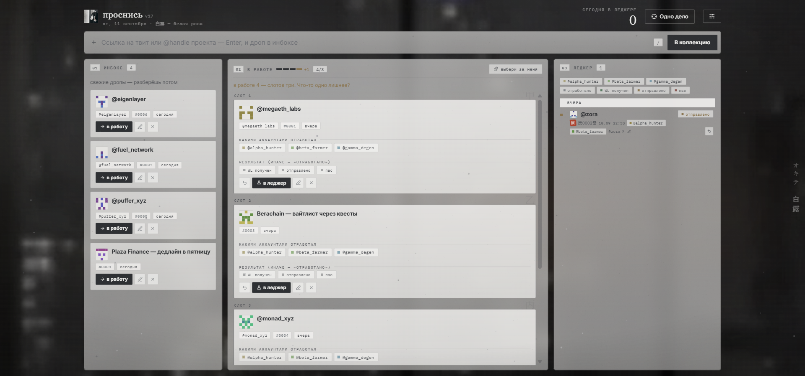

# проснись (オキテ)

Пепельный дашборд для WL-фермы: поймал дроп → инбокс → в работе (максимум 3 слота) → леджер. Один HTML-файл, ноль сборки, данные хранятся локально.



## Быстрый старт

Открой `index.html` двойным кликом (Chrome / Edge / любой современный браузер) — всё работает сразу. Интернет нужен для шрифтов и движка пепла с CDN; офлайн дашборд тоже живой, просто без пепла и кастомных шрифтов.

## Что внутри

- **Инбокс** — кидай ссылки на твиты, @handle или любые URL (пачкой через пробел/переносы, или файлом .txt по строке). Дубли ловятся сами.
- **В работе** — три слота 甲乙丙, больше трёх не влезает (это фича). «выбери за меня» — случайный проект из инбокса против паралича выбора.
- **Леджер** — архив завершённого: серийник 第N番, дата, аккаунты, результат (WL получен / отправлено / пас). Фильтры по аккаунтам и результатам. У каждой записи — печать 灰.
- **Одно дело** — фокус-режим на одну карточку (кнопка в шапке, Esc — выход).
- **Сэкки** — в шапке и у правого края текущий японский микросезон (白露, 秋分…), меняется сам по дате.
- `/` — фокус на строке ввода, вставка ссылок из буфера в любом месте окна.

## Где мои данные

Всё в `localStorage` твоего браузера (ключ `kollektsiya.v1`) — никуда не улетает. Резервная копия и перенос: «Выгрузить JSON» / «Загрузить JSON» в ящике настроек (кнопка-шестерёнка в шапке).

## Десктоп-обёртка (Windows, опционально)

```
pip install pywebview
python kollekciya.py
```

Отдельное окно без браузерных табов, данные те же localStorage в постоянном профиле WebView2.

## Стек

Ванильный HTML/CSS/JS в одном файле · [tsParticles](https://particles.js.org/) (пепел) · Google Fonts (Zen Old Mincho, IBM Plex Mono, Inter) · иконки Lucide.
